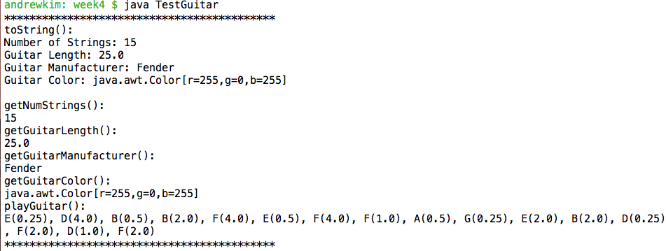
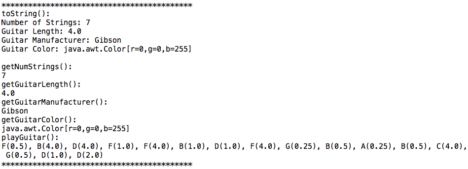
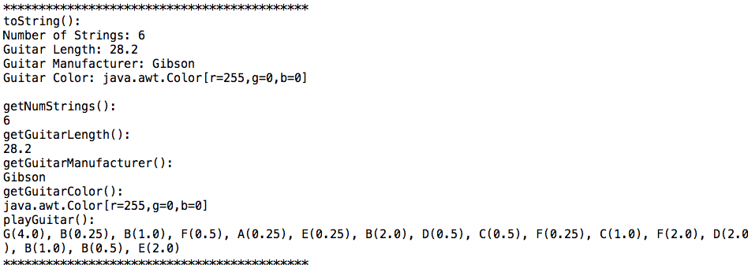

# Homework 2

## Test Case 1 - Passed

### Input
> Guitar was created using the following java code

```java
Color magenta = Color.magenta;
Guitar guitar1 = new Guitar(15, 25, "Fender", magenta);
```

- number of strings: 15
- guitar length: 25
- guitar manufacturer: Fender
- guitar color: magenta

### Expected Output
```
toString():
Number of Strings: 15
Guitar Length: 25.0
Guitar Manufacturer: Fender
Guitar Color: java.awt.Color[r=255,g=0,b=255]

getNumStrings():
15
getGuitarLength():
25.0
getGuitarManufacturer():
Fender
getGuitarColor():
java.awt.Color[r=255,g=0,b=255]
playGuitar(): // random notes and durations
```

### Actual Output
```
toString():
Number of Strings: 15
Guitar Length: 25.0
Guitar Manufacturer: Fender
Guitar Color: java.awt.Color[r=255,g=0,b=255]

getNumStrings():
15
getGuitarLength():
25.0
getGuitarManufacturer():
Fender
getGuitarColor():
java.awt.Color[r=255,g=0,b=255]
playGuitar():
E(0.25), D(4.0), B(0.5), B(2.0), F(4.0), E(0.5), F(4.0), F(1.0), A(0.5), G(0.25), E(2.0), B(2.0), D(0.25), F(2.0), D(1.0), F(2.0)
```
### Screenshot


## Test Case 2 - Passed

### Input

> Guitar was created using the following java code

```java
Color blue = Color.blue;
Guitar guitar2 = new Guitar(7, 4, "Gibson", blue);
```

- number of strings: 7
- guitar length: 4
- guitar manufacturer: Gibson
- guitar color: blue

### Expected Output
```
toString():
Number of Strings: 7
Guitar Length: 4.0
Guitar Manufacturer: Gibson
Guitar Color: java.awt.Color[r=0,g=0,b=255]

getNumStrings():
7
getGuitarLength():
4.0
getGuitarManufacturer():
Gibson
getGuitarColor():
java.awt.Color[r=0,g=0,b=255]
playGuitar(): // random notes and durations
```

### Actual Output
```
toString():
Number of Strings: 7
Guitar Length: 4.0
Guitar Manufacturer: Gibson
Guitar Color: java.awt.Color[r=0,g=0,b=255]

getNumStrings():
7
getGuitarLength():
4.0
getGuitarManufacturer():
Gibson
getGuitarColor():
java.awt.Color[r=0,g=0,b=255]
playGuitar():
F(0.5), B(4.0), D(4.0), F(1.0), F(4.0), B(1.0), D(1.0), F(4.0), G(0.25), B(0.5), A(0.25), B(0.5), C(4.0), G(0.5), D(1.0), D(2.0)
```

### Screenshot



## Test Case 3 - Passed

### Input

> Guitar was created using the following java code

```java
Guitar guitar2 = new Guitar();
```

> No inputs were used to test default scenarios

### Expected Output
```
toString():
Number of Strings: 6
Guitar Length: 28.2
Guitar Manufacturer: Gibson
Guitar Color: java.awt.Color[r=255,g=0,b=0]

getNumStrings():
6
getGuitarLength():
28.2
getGuitarManufacturer():
Gibson
getGuitarColor():
java.awt.Color[r=255,g=0,b=0]
playGuitar():  // random notes and durations
```

### Actual Output
```
toString():
Number of Strings: 6
Guitar Length: 28.2
Guitar Manufacturer: Gibson
Guitar Color: java.awt.Color[r=255,g=0,b=0]

getNumStrings():
6
getGuitarLength(): 
28.2
getGuitarManufacturer():
Gibson
getGuitarColor():
java.awt.Color[r=255,g=0,b=0]
playGuitar():
G(4.0), B(0.25), B(1.0), F(0.5), A(0.25), E(0.25), B(2.0), D(0.5), C(0.5), F(0.25), C(1.0), F(2.0), D(2.0), B(1.0), B(0.5), E(2.0)
```

### Screenshot

